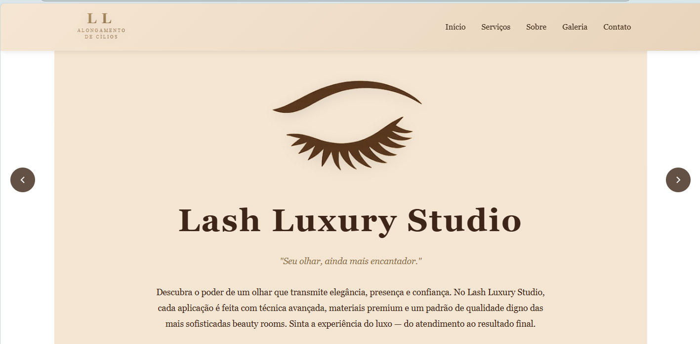
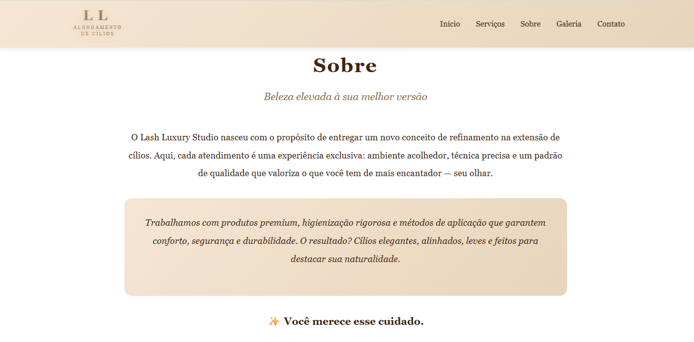

# 💎 Lash Luxury Studio

> Website elegante e sofisticado para estúdio de extensão de cílios

## 📸 Screenshots


        
      
---


## ✨ Sobre o Projeto

Site desenvolvido para o **Lash Luxury Studio**, um estúdio premium de alongamento de cílios que oferece serviços sofisticados com um padrão de qualidade diferenciado. O design transmite elegância, luxo e profissionalismo, refletindo a experiência única oferecida aos clientes.

---

## 🎯 Funcionalidades

### 🌟 Principais Recursos

- **Menu Responsivo com Hambúrguer** 
  - Menu lateral deslizante em dispositivos móveis
  - Animações suaves e transições elegantes
  - Fecha automaticamente ao clicar em links

- **Hero Section Impactante**
  - Logo SVG personalizado e elegante
  - Texto introdutório atraente
  - Design que transmite sofisticação

- **Seção de Serviços**
  - Cards informativos sobre cada serviço
  - Efeito hover com elevação
  - Layout responsivo em grid

- **Carrossel de Galeria Automático**
  - Troca automática de imagens a cada 4 segundos
  - Navegação por setas (desktop)
  - Swipe touch para mobile
  - Indicadores visuais de posição
  - Descrições personalizadas para cada serviço
  - Pausa ao passar o mouse
  - Navegação por teclado (← →)

- **Seção Sobre**
  - Apresentação do estúdio
  - Destaque para diferenciais
  - Design clean e elegante

- **Contato Completo**
  - Botão WhatsApp integrado com ícone
  - Informações de contato organizadas
  - Mapa do Google integrado
  - Design responsivo

- **100% Responsivo**
  - Desktop (1200px+)
  - Tablet (768px - 1200px)
  - Mobile (< 768px)

---

## 🚀 Tecnologias Utilizadas

- **HTML5** - Estrutura semântica
- **CSS3** - Estilização moderna com:
  - Flexbox e Grid Layout
  - Gradientes lineares
  - Animações e transições
  - Media queries para responsividade
- **JavaScript Vanilla** - Interatividade:
  - Carrossel automático
  - Menu hambúrguer
  - Smooth scroll
  - Animações ao scroll
  - Touch events para mobile

---

## 📂 Estrutura de Arquivos

```
lash-luxury-studio/
│
├── index.html          # Página principal
├── styles.css          # Estilos CSS
├── scripit.js          # Lógica JavaScript
├── README.md           # Documentação
│
└── assets/
    ├── logo.png        # Logo principal
    └── galeria/        # Imagens da galeria
        ├── photo1.png
        ├── photo2.png
        ├── photo3.png
        ├── photo4.png
        ├── trabalho5.jpg
        └── trabalho6.jpg
```

---

## 🎨 Paleta de Cores

```css
/* Cores Principais */
--primary-brown: #3d2517;      /* Marrom escuro */
--gold-brown: #8b6f47;          /* Dourado escuro */
--light-beige: #f5e6d3;         /* Bege claro */
--medium-beige: #e8d4bb;        /* Bege médio */

/* WhatsApp */
--whatsapp-green: #25D366;      /* Verde WhatsApp */
--whatsapp-dark: #128C7E;       /* Verde escuro */
```

---

## 🖼️ Seções do Site

### 1. **Header (Navegação)**
- Logo SVG elegante
- Menu desktop com links
- Menu hambúrguer mobile
- Fundo gradiente bege

### 2. **Hero Section**
- Logo grande centralizado
- Título e slogan
- Texto de apresentação
- Design imersivo

### 3. **Serviços**
- Grid de 3 cards
- Ícones decorativos
- Descrição de cada serviço:

  - ✨ Lash Luxury
  - ✨ Lash Lifting
  - ✨ Divine Lashes
  - ✨ Volume Russo
  - ✨ Volume 3D
  - ✨ Volume Brasileiro
  - 💎 Lash Botox (Hidratação)
  - 🌸 Manutenção
  - 💧 Remoção Profissional

### 4. **Sobre**
- História do estúdio
- Destaque para diferenciais
- Box com informações premium

### 5. **Galeria**
- Carrossel automático
- 6 tipos de serviços com descrições:
  - Extensão Clássica
  - Volume Russo
  - Mega Volume
  - Lash Lifting
  - Volume Brasileiro
  - Efeito Fox Eyes

### 6. **Contato**
- Botão WhatsApp estilizado
- Informações de contato
- Google Maps integrado
- Layout em duas colunas

### 7. **Footer**
- Slogan do estúdio
- Copyright
- Design minimalista

---

## 📱 Responsividade

O site é totalmente responsivo e se adapta a diferentes tamanhos de tela:

| Dispositivo | Largura | Características |
|-------------|---------|-----------------|
| Desktop     | > 1024px | Layout completo, menu horizontal |
| Tablet      | 768-1024px | Ajustes de espaçamento |
| Mobile      | < 768px | Menu hambúrguer, layout vertical |
| Mobile Pequeno | < 480px | Otimização máxima |

---

## 🎯 Recursos do Carrossel

- ✅ **Auto-play**: Troca automática a cada 4 segundos
- ✅ **Controles**: Setas para navegação manual
- ✅ **Indicadores**: Bolinhas mostrando posição atual
- ✅ **Pausa**: Para ao passar o mouse (desktop)
- ✅ **Touch**: Arraste com o dedo (mobile)
- ✅ **Teclado**: Use ← e → para navegar
- ✅ **Descrições**: Cada foto tem título e descrição

---

## 🛠️ Personalização

### Alterar Cores
Edite as variáveis de cor no arquivo `styles.css`:
```css
/* Procure por estas cores e altere conforme desejado */
#3d2517  /* Marrom principal */
#8b6f47  /* Dourado */
#f5e6d3  /* Bege claro */
```

### Adicionar/Remover Slides
No arquivo `index.html`, adicione ou remova blocos:
```html
<div class="carousel-slide">
    
    <div class="carousel-caption">
        <h3>Nome do Serviço</h3>
        <p>Descrição do serviço</p>
    </div>
</div>
```

### Ajustar Velocidade do Carrossel
No arquivo `scripit.js`, linha 89:
```javascript
autoPlayInterval = setInterval(nextSlide, 4000); // 4000ms = 4 segundos
```

---

[](https://developer.mozilla.org/pt-BR/docs/Web/HTML)
[](https://developer.mozilla.org/pt-BR/docs/Web/CSS)
[](https://developer.mozilla.org/pt-BR/docs/Web/JavaScript)


---

##👩‍💻 Autora

**Desenvolvido por:**

  <a href="https://www.linkedin.com/in/daniellypedrini/" target="_blank">
    
  </a> <br>
  
<a href="https://wa.me/5515991563363" target="_blank">
    
  </a> <br>
  
  <a href="mailto:Daniellypedrini@outlook.com" target="_blank">
    
  </a> <br>

  <a href="https://github.com/danielly-pedrini" target="_blank">
    
  </a> 

---


<div align="center">
  
### ✨ Desenvolvido com dedicação para proporcionar elegância e sofisticação ✨

**Se este projeto foi útil para você, considere dar uma ⭐**

</div>


